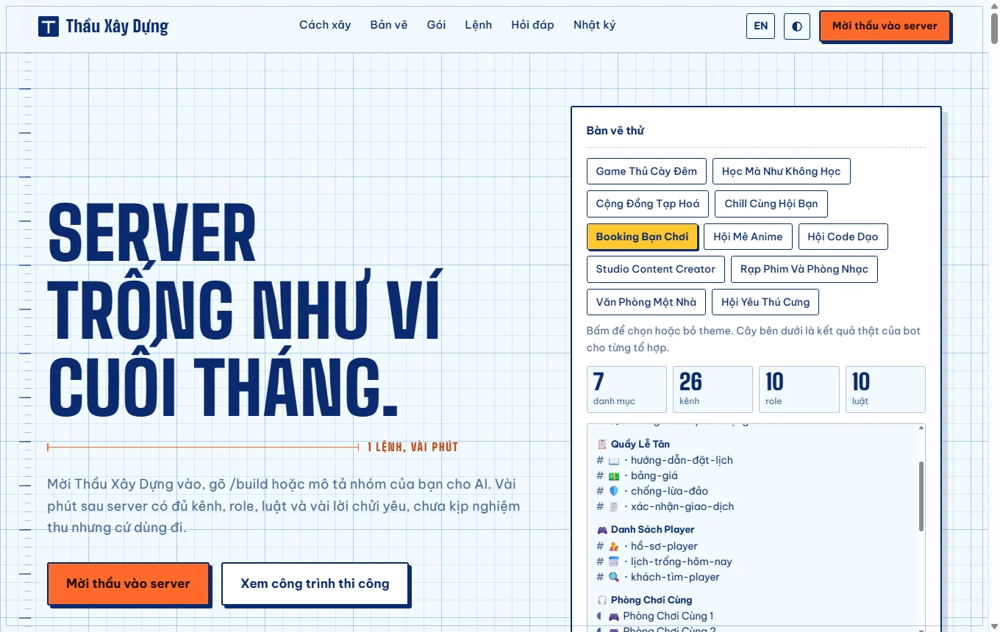
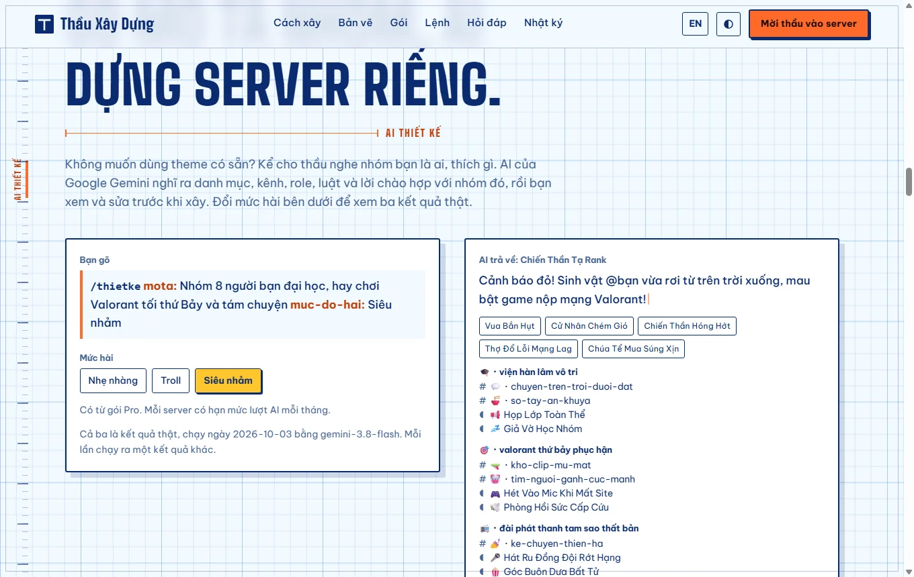
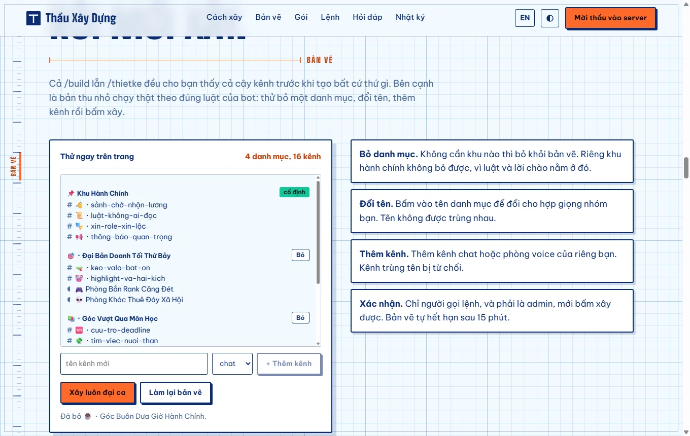
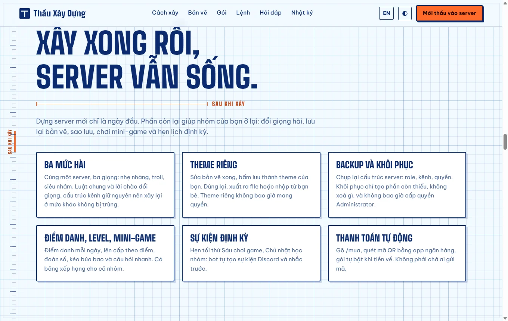
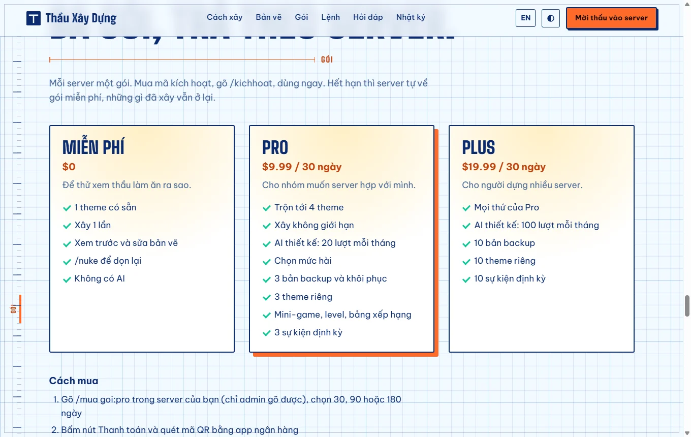

# buildDISCORD

[](https://github.com/nhaajtt/buildDISCORD/actions/workflows/ci.yml)
[](https://builddiscord.vercel.app)



A Discord bot nicknamed **Thầu Xây Dựng** ("the contractor"). Invite it to an empty server, run `/build`, and a few minutes later the server has categories, text and voice channels, roles, rules, a welcome message and a role picker, all written in Vietnamese meme humor. Then it keeps the server alive: levels, mini-games, recurring events, backups and your own saved themes.

Website: https://builddiscord.vercel.app (Vietnamese and English), with live demos of the theme merge, the AI designer and the blueprint editor.

Made by [nhaajt](https://github.com/nhaajtt) ([website](https://www.nhaajt.com/), [Instagram](https://www.instagram.com/nhaajt_hehee/)). The story of how it was built, including what went wrong, is in [docs/devlog.md](docs/devlog.md). It is a sibling of [musiDISCORD](https://github.com/nhaajtt/musiDISCORD) and [companionsDISCORD](https://github.com/nhaajtt/companionsDISCORD), and runs next to them on the same Raspberry Pi.

**Status: feature complete for version 1.4 and running in production.** What is next is under [Roadmap](#roadmap).

## What it does

**Build a server**
- **`/build`** builds a whole server from one theme, or from up to four mixed themes. Eleven themes ship in the box: late-night gamers, studying without studying, a general-store community, chill with the crew, **book a friend** (a server where people book someone to play a game with or talk to), anime fans, coders, content creators, cinema and music, an office team, and pet lovers.
- **Three humor levels** (gentle, troll, absurd) change the words of the shared rules and the welcome, never the structure, so rebuilding at another level duplicates nothing.
- **`/thietke`** takes a short description of your group and asks Google Gemini to design the server.
- **A blueprint you can edit.** Every build shows a tree first. Remove a category, rename one, add a channel, save it as your own theme, then confirm. Nothing is created without a click.
- **Safe to run twice, and safe to undo.** Existing things are skipped, content is not posted twice, and `/nuke` deletes only what the bot recorded.

**Keep it alive**
- **Your own themes.** Save a blueprint as a theme, reuse it, export it to a file or import one from a friend. A saved theme can never carry permissions.
- **Backup and restore.** Snapshot roles, channels and permissions. Restore only creates what is missing, deletes nothing, and never grants Administrator. A snapshot from another server also loses its other powerful permissions.
- **Check-in, levels and mini-games.** A daily check-in with streaks, level roles, a leaderboard, guess the number, rock paper scissors duels and quick trivia.
- **Recurring events.** Weekly Discord events created and announced by the bot.

**Run it as a business**
- **Plans per server** (free, Pro, Plus) with limits for everything above. See [Plans](#plans).
- **Automatic payments.** `/mua` creates a payOS payment link with a QR code; the bot polls its own open orders and switches the plan on when the money arrives. Activation codes still work for buying by hand.

The bot never reads message content and uses no privileged intent. Discord does not let a bot add another bot, so the music and text-to-speech rooms come with an invite button for the bots you configure.

## Screenshots

| | |
| --- | --- |
|  |  |
|  |  |

## Commands

| Command | Who | What it does |
| --- | --- | --- |
| `/build theme [theme2..theme4] [muc-do-hai]` | Administrators | Blueprint for one or more mixed themes at a humor level, then build |
| `/thietke mota [muc-do-hai]` | Administrators, Pro | AI designs the server from a description |
| `/theme danhsach, dung, xoa, xuat, nhap` | Administrators, Pro | Reuse, delete, export and import saved themes |
| `/backup tao, khoiphuc, danhsach, xoa, xuat, nhap` | Administrators, Pro | Back up the layout and restore what is missing |
| `/sukien tao, danhsach, xoa, mau` | Administrators, Pro | Weekly recurring events |
| `/diemdanh`, `/bangxephang` | Everyone, Pro server | Daily check-in and the leaderboard |
| `/doanso`, `/thachdau`, `/cauhoi` | Everyone, Pro server | Guess the number, rock paper scissors, trivia |
| `/nuke` | Administrators | Removes what the bot built, after confirmation |
| `/mua goi [ngay]` | Administrators | Buy or renew a plan, paid by bank transfer |
| `/kichhoat ma` | Administrators | Activates a plan with a code |
| `/goi` | Everyone | The server's plan and how to upgrade |
| `/xoadulieu` | Administrators | Makes the bot forget what it built (channels and roles on Discord stay) |
| `/roast nguoi` | Everyone | A gentle roast |
| `/admin taoma, cap, thuhoi, thongke, donhang` | Bot owner only | Make codes, grant or revoke plans, plan counts, recent orders |

## Plans

| | Free | Pro | Plus |
| --- | --- | --- | --- |
| Themes per build | 1 | up to 4 mixed | up to 4 mixed |
| Builds | 1 in total | unlimited | unlimited |
| Humor level | troll | any | any |
| AI designs per month | 0 | 20 | 100 |
| Backups | 0 | 3 | 10 |
| Saved themes | 0 | 3 | 10 |
| Recurring events | 0 | 3 | 10 |
| Check-in, levels, mini-games | no | yes | yes |
| Price per server | $0 | $9.99 / 30 days | $19.99 / 30 days |

### Payments

`/mua goi:pro` records an order, asks payOS for a payment link and shows it with a Pay button. The amount in dong is the dollar price converted at `USD_VND_RATE`, rounded to a thousand. There is no public address for payOS to call, so a job asks payOS about the open orders every 30 seconds; the order's status change from pending to paid is the guard that grants the plan exactly once, and the customer gets a message in the channel where they ran the command. Orders expire after 35 minutes. Without the payOS keys `/mua` says how to buy by hand.

Buying by hand still works: the owner makes a code with `npm run license -- new pro 30d` (or `/admin taoma`), the customer runs `/kichhoat`, and the plan ends by itself when the days run out. Codes are single use, and a second code of the same plan adds its days after the current expiry.

## Setup

1. Create an application in the [Discord Developer Portal](https://discord.com/developers/applications), add a Bot and copy the token and the Application ID. No privileged intent is needed.
2. Invite the bot with this link (replace `CLIENT_ID`). Administrator is the easy choice, because the bot manages channels, roles, events and the server and posts into read-only channels:
   `https://discord.com/oauth2/authorize?client_id=CLIENT_ID&scope=bot%20applications.commands&permissions=8`
3. Copy `.env.example` to `.env` and fill it in (see [Configuration](#configuration)).
4. Install and run:
   ```bash
   npm install
   npm run deploy-commands   # registers the slash commands
   npm start
   ```

Node 22.13 or newer is required, because the bot uses the SQLite module built into Node.

### On a Raspberry Pi (or any Debian box)

```bash
curl -fsSL https://raw.githubusercontent.com/nhaajtt/buildDISCORD/main/scripts/install-pi.sh | sh
```

The installer installs Docker and git, fetches the project into `~/buildDISCORD`, asks for the token and the Application ID, starts the container and optionally installs a daily self-update timer. It never overwrites an existing `.env` and is safe to run again. It shares nothing with musiDISCORD or companionsDISCORD at runtime, so all three can run on one machine.

To install the daily self-update by hand later (it needs sudo):

```bash
cd ~/buildDISCORD
for ext in service timer; do sed "s#__USER__#$USER#g; s#__DIR__#$PWD#g" deploy/pi/thauxaydung-update.$ext | sudo tee /etc/systemd/system/thauxaydung-update.$ext >/dev/null; done
sudo systemctl daemon-reload && sudo systemctl enable --now thauxaydung-update.timer
```

The update script fetches new commits, accepts fast-forwards only, rebuilds, waits for the container's health check to pass and rolls back to the previous version if it does not. After an update that changes slash commands, run `docker compose run --rm bot node src/deploy-commands.js` once.

### The website

`web/` is a Next.js site deployed on Vercel from this repository: the project's root directory is `web`, a push to `main` deploys it, and a push that changes nothing under `web/` skips the build.

## Configuration

| Variable | Needed | Meaning |
| --- | --- | --- |
| `DISCORD_TOKEN` | yes | Bot token |
| `CLIENT_ID` | yes | Application ID |
| `GUILD_ID` | no | Register commands on one server only (instant). Empty means global, which can take a while to appear |
| `OWNER_IDS` | no | Comma separated Discord user IDs allowed to use `/admin` |
| `MUSIC_BOT_INVITE_URL`, `TTS_BOT_INVITE_URL` | no | Invite links behind the buttons in the DJ and text-to-speech channels |
| `GEMINI_API_KEY` | no | Key from [Google AI Studio](https://aistudio.google.com/apikey). Without it `/thietke` stays off |
| `GEMINI_MODEL` | no | Force a model name. Empty means the bot picks the newest stable flash model your key can use |
| `PAYOS_CLIENT_ID`, `PAYOS_API_KEY`, `PAYOS_CHECKSUM_KEY` | no | payOS credentials. All three switch `/mua` on |
| `USD_VND_RATE` | no | Dong per dollar for the price charged (default 26000). Update it when the rate moves |
| `SITE_URL` | no | Where payOS sends a customer after paying or cancelling |
| `TIMEZONE` | no | Time zone for check-in days and recurring events (default `Asia/Ho_Chi_Minh`) |
| `CONTACT_TEXT` | no | Shown by `/goi`: how a customer buys by hand |
| `ALERT_WEBHOOK_URL` | no | Discord webhook that receives errors and a "started" message |
| `DATA_DIR` | no | Where the database lives (default `data`) |
| `BUILD_STEP_DELAY_MS` | no | Pause after each created channel or role, default 350 (tests use 0) |

## What is stored

For each server: its ID, the theme used, the IDs of the channels, categories and roles the bot created, the active license (plan and expiry), usage counters, and, when the features are used, saved themes, backups (a copy of the layout, never message content), recurring event definitions and members' points, streaks and last check-in day. Payment orders keep the plan, days, amount, status and the Discord IDs of the server and the person who ran `/mua`. For `/thietke`, the description you type is sent to Google Gemini; on Google's free tier Google may use it to improve its products, so do not put anything private in it. Message content is never read or stored. `/xoadulieu` erases a server's record.

The database is `data/thauxaydung.db` (SQLite). A consistent copy is written to `data/backups` once a day and the last seven are kept.

## Project layout

```
src/
  index.js, config.js, db.js, store.js, license.js, builder.js, jobs.js
  commands/      one file per slash command
  events/        ready, interactionCreate, guildCreate
  jobs/          background jobs, one file each: payments, recurring events
  themes/        shared parts, the eleven themes, humor levels, saved themes, and the merge into one plan
  ai/            Gemini client, the designer prompt, and the validator that cleans its answer
  backups/       snapshot, validation, restore planning and execution
  games/         points, levels, the three mini-games, the question bank, the event schedule
  pay/           payOS client and the order lifecycle
  ui/editor.js   blueprint view and its buttons, menus and modals
  blueprints.js  the plan being edited (in memory, 15 minutes)
  humor/         every line the bot says
scripts/         license CLI, Raspberry Pi installer and updater, website data export
deploy/pi/       systemd unit and timer for the daily update
web/             the website (Next.js), Vietnamese and English
docs/            devlog, architecture, screenshots
test/            node --test
```

More in [docs/architecture.md](docs/architecture.md).

## Development

```bash
npm test                         # all tests, no Discord and no network needed
node scripts/license.js          # prints the license CLI usage
node scripts/export-web-data.js  # refresh the data the website shows (a test fails when it is stale)
cd web && npm install && npm run dev
```

Everything that decides something is a plain module tested with a fake Discord server, a fake clock and a fake `fetch`; command handlers are exercised with minimal fake interactions. Only `src/index.js` and the event files touch the real Discord gateway.

## Engineering highlights

- **Idempotent builds and safe undo.** Creation reports whether it made anything, so a second `/build` creates and posts nothing twice, and `/nuke` deletes only recorded IDs, even after a build that failed halfway: `src/builder.js`.
- **Defence against forged interactions.** Every select, modal and button re-checks the guild, the person and the administrator permission, and role buttons only grant recorded roles: `src/ui/editor.js`, `src/events/interactionCreate.js`.
- **An LLM treated as untrusted input.** Schema-constrained output, a sanitiser, a per-minute bot-wide limit, a per-server monthly quota, a typed error taxonomy and retries: `src/ai/gemini.js`, `src/ai/validate.js`, `src/ai/designer.js`.
- **Restore that cannot escalate privileges.** Administrator is never restored, files from another server lose their other powerful bits, downloads come only from Discord's hosts with no redirect, and every imported field is rebuilt rather than trusted: `src/backups/restore.js`, `src/backups/attachment.js`.
- **Payments without a public endpoint.** Polling of open orders, a single status flip as the exactly-once guard for granting a plan, and a signed request tested against the documented rule: `src/pay/payos.js`, `src/pay/orders.js`, `src/jobs/payments.js`.
- **Licensing and quotas.** Single-use codes over an unambiguous alphabet, plans derived from licenses so nothing needs to expire, and every rule tested with an injected clock: `src/license.js`, `src/utils/gate.js`.
- **Extensible by dropping a file.** Commands, events and background jobs are loaded from their folders; a job never overlaps itself and one failing job cannot stop the others: `src/jobs.js`.
- **Storage that grew with the product.** A move from JSON files to the SQLite module built into Node with an automatic, non-destructive import, WAL mode and daily `VACUUM INTO` copies: `src/db.js`, `src/backup.js`.
- **Operations you can leave alone.** A heartbeat-based Docker health check, alerts that cannot flood a channel, graceful shutdown, and a self-update that rolls back unless the new version becomes healthy: `src/healthcheck.js`, `src/alerts.js`, `scripts/update.sh`.
- **A website that cannot drift from the bot.** The theme data on the site is generated from the bot's own code, and a test compares the website's port of the merge with the bot for all 561 mixes: `scripts/export-web-data.js`, `test/webdata.test.js`.

**Numbers:** about 4,600 lines of bot code in 73 files, 128 tests in 11 files that run in about 9 seconds, 17 slash commands, 8 database tables, 2 background jobs, 2 runtime dependencies, an arm64 Docker image of 187 MB, and 11 themes that combine into 561 plans (any mix of up to four) of up to 22 roles, 13 categories and 54 channels. The full story, including what is still missing, is in [docs/devlog.md](docs/devlog.md).

## Roadmap

- Payments by webhook, once there is a public address to receive it (polling is the stand-in)
- A test harness that drives the handlers end to end against a fake gateway
- Per-server settings (language, default humor level, announcement channel)
- Sharding and a database server, for the day the bot is in thousands of servers

## Privacy and terms

Plain-language pages are on the website: `/privacy` and `/terms`, in Vietnamese and English.
