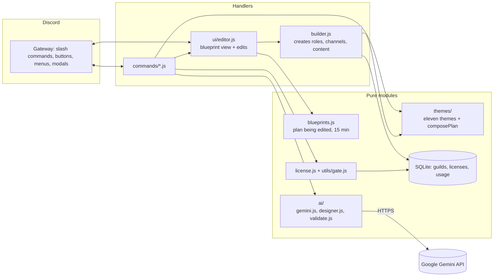
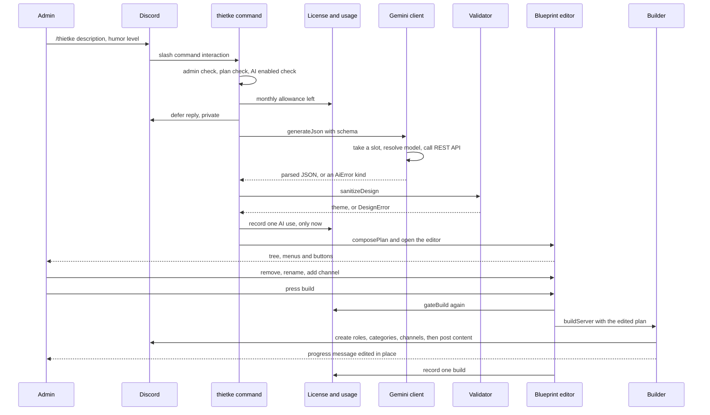
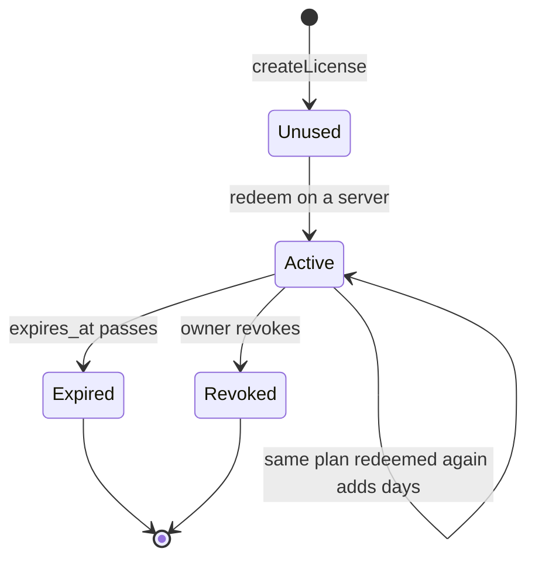
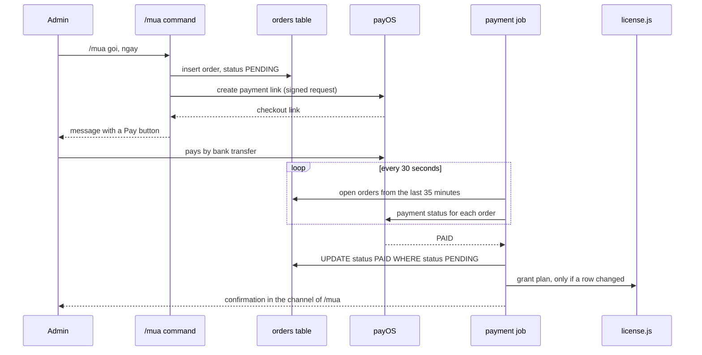
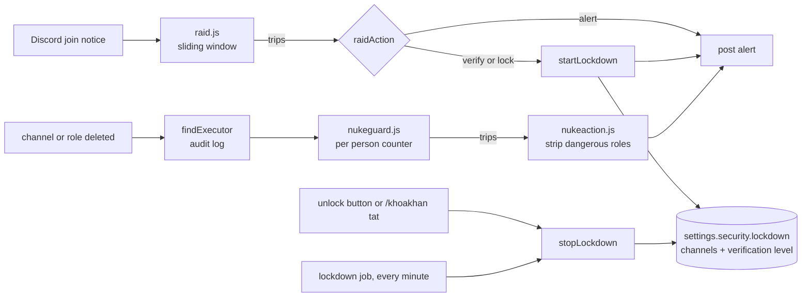

# Architecture

buildDISCORD is one Node process with one bot account. The design goal: everything interesting (merging themes, plans, licenses, cleaning an AI answer, editing a blueprint) lives in plain modules that never touch Discord, so it can be tested without a network. The files that know about Discord are the command files, `src/ui/editor.js`, `src/builder.js` and the event handlers.

## From a command to a server

1. `/build` merges the chosen themes into one **plan** with `composePlan`: shared parts first (admin area), then each theme's categories, then the DJ rooms and the mod-only area. Channels and categories with the same name appear once.
2. `/thietke` asks Gemini for a theme-shaped JSON, cleans it with `sanitizeDesign` and merges it with the same shared parts, so an AI server always has rules, welcome, role picker, DJ booth and a text-to-speech channel.
3. The plan becomes a **blueprint** held in memory for 15 minutes. `ui/editor.js` renders it as a tree with a select menu to remove a category, another to rename one, and buttons to add a channel, build or cancel. Only the person who started it, and only an administrator, can touch it.
4. **Build** runs `builder.js`: roles, then categories and channels (with permission overwrites for the mod-only area and read-only channels), then it posts the rules, welcome, role picker and the two invite buttons into the channels it just created. Each step edits one progress message. A lock stops two builds from running in the same server.
5. Every created ID is saved. `/nuke` deletes by those IDs, and the role buttons only grant roles in that list.

## Data

SQLite through the module built into Node 22 (`src/db.js`).

| Table | Columns | Holds |
| --- | --- | --- |
| `guilds` | `id` TEXT primary key, `record` TEXT (JSON), `updated_at` INTEGER | per server: the theme, and the IDs of the roles, pick-roles, categories and channels the bot created |
| `licenses` | `code` TEXT primary key, `plan`, `days`, `created_at`, `guild_id`, `redeemed_at`, `expires_at`, index `licenses_guild` on `guild_id` | one row per code, from creation to redemption |
| `usage` | `guild_id`, `month`, `feature`, `count` (default 0), primary key on the first three | counters: lifetime builds (`month = "all"`) and AI designs per UTC month |
| `custom_themes` | `guild_id`, `name`, `theme` (JSON), `created_at`, primary key on the first two | themes a server saved from a blueprint |
| `backups` | `id`, `guild_id`, `name`, `data` (JSON), `created_at`, unique on `guild_id` and `name` | layout snapshots |
| `scores` | `guild_id`, `user_id`, `points`, `streak`, `last_checkin` (a YYYY-MM-DD day in the configured zone), `updated_at`, index on points per guild | check-in streaks and the leaderboard |
| `recurring_events` | `id`, `guild_id`, `name`, `description`, `weekday`, `hour`, `minute`, `duration_min`, `channel_id`, `notify_role_id`, `last_event_start`, `created_at` | weekly event definitions |
| `orders` | `order_code` (primary key), `guild_id`, `user_id`, `channel_id`, `plan`, `days`, `amount`, `status`, `checkout_url`, `created_at`, `paid_at` | payment orders |
| `guild_settings` | `guild_id` TEXT primary key, `data` TEXT (JSON), `updated_at` | one document per server with a section per tool: welcome, automod (with the custom word list and the recorded rule ids), tickets, security (with the account age filter), activity, digest, modlog, setup, tempvoice, stats, suggest |
| `tickets` | `id`, `guild_id`, `channel_id` (unique), `user_id`, `type`, `status`, `claimed_by`, `created_at`, `closed_at`, `close_reason`, index on `guild_id` and `status` | who opened which private channel, never messages |
| `audit_reports` | `id`, `guild_id`, `score`, `report` (JSON), `created_at`, index on `guild_id` and `created_at` | health check results, for the trend |
| `events_log` | `id`, `guild_id`, `kind`, `at`, indexes on `kind` and `at` and on `guild_id`, `kind` and `at` | the funnel (invite, wizard_done, build_done, feature_on, trial, paid, left) and the weekly report's join and AutoMod block counts; no person, no content |
| `xp` | `guild_id`, `user_id`, `xp`, `msgs`, `voice_min`, `day`, `day_xp`, `last_msg_at`, primary key on the first two, index on `guild_id` and `xp` | activity points per member |
| `giveaways` | `id`, `guild_id`, `channel_id`, `message_id`, `host_id`, `prize`, `winners`, `ends_at`, `status`, `winner_ids` (JSON), `created_at`, index on `status` and `ends_at` | giveaways, active or closed |
| `giveaway_entries` | `giveaway_id`, `user_id`, primary key on both | one row per person who pressed Join |
| `polls` | `id`, `guild_id`, `channel_id`, `message_id`, `question`, `options` (JSON), `ends_at`, `status`, `created_by`, `created_at`, index on `status` and `ends_at` | polls |
| `poll_votes` | `poll_id`, `user_id`, `option_index`, primary key on the first two | one vote per person, replaced when changed |
| `mod_cases` | `id`, `guild_id`, `user_id`, `mod_id`, `action` (warn, timeout, kick, ban), `reason`, `until`, `at`, index on `guild_id`, `user_id` and `at` | the case history behind `/hoso` |
| `role_menus` | `id`, `guild_id`, `channel_id`, `message_id`, `title`, `mode` (single or multi), `roles` (JSON list of role id and emoji), `created_at`, index on `guild_id` | role menus |
| `temp_voice` | `channel_id` (primary key), `guild_id`, `owner_id`, `created_at`, index on `guild_id` | the temporary voice rooms the bot made; only a row here may ever be deleted by the cleanup |
| `scheduled_messages` | `id`, `guild_id`, `channel_id`, `body`, `weekday` (null for daily), `hhmm`, `next_at`, `last_sent_at`, `status`, `created_by`, `created_at`, index on `status` and `next_at` | messages the admin scheduled |
| `reminders` | `id`, `guild_id` (null in a direct message), `user_id`, `channel_id`, `body`, `due_at`, `status` (pending, done, failed), `created_at`, indexes on `status` and `due_at` and on `user_id` and `status` | personal reminders |
| `suggestions` | `id`, `guild_id`, `channel_id`, `message_id`, `user_id`, `body`, `status`, `decided_by`, `note`, `created_at`, index on `guild_id` and `status` | suggestions and their staff decision |
| `suggestion_votes` | `suggestion_id`, `user_id`, `value` (1 or -1), primary key on the first two | one vote per person, replaced when changed |

Giveaways keep an optional required role in a small side table, `giveaway_roles`, created on first use so the shared table did not change.

The `record` column is a JSON document that is read and written whole and never filtered by field, so it stays a single column. Timestamps are milliseconds since the epoch. WAL mode is on so the daily `VACUUM INTO` copy can run while the bot writes.

A plan is derived, not stored: the highest-ranked license that has not expired, else free. Limits live in one table in `src/license.js`, and `utils/gate.js` turns them into refusals with a plain message.

## AI

`ai/gemini.js` talks to Google's REST API with `fetch`, sends the key in a header (never in the URL), asks for JSON that follows a schema, and picks a model by listing what the key can use. It caps the whole bot at ten requests a minute. `ai/validate.js` is the safety net: it never trusts the answer, it cleans it. Errors are classified (`off`, `key`, `quota`, `busy`, `unavailable`, `model`, `bad`) and each gets its own message. An unusable answer is retried once, a missing model is re-resolved once, and an overloaded service (5xx) is retried twice after 1.5 s and 4 s. If it still fails the person gets a message and the attempt is not counted.

## Running it

The Docker image runs `node src/index.js`. The bot writes `data/heartbeat` every 30 seconds, which is what the image's health check reads. `data/` is a mounted volume holding the database and the daily copies. On the Raspberry Pi a systemd timer runs `scripts/update.sh` daily: fast-forward only, rebuild, wait for healthy, roll back otherwise.

## A `/thietke` request from start to finish

## Licenses as a state machine

A code and a server's plan are two small state machines. The plan is never stored, it is computed from the codes.

A server's plan is the highest-ranked license that is Active at the moment of the query, otherwise `free`. Redeeming a second code of the same plan sets the new expiry to the later of now and the current expiry, plus the code's days. Revoking sets `expires_at` to now, so the same query ends it with no extra state.

## Background jobs and payments

`src/jobs.js` loads every file in `src/jobs`, each exporting `{ name, everyMs, run(client) }`. A job runs once at start and then on its own timer, never overlaps itself, and a failure is logged and alerted without stopping the other jobs. There are eleven: payments (every 30 seconds), recurring events (every five minutes), tickets, the weekly health check, the weekly report, lockdown expiry (every minute), giveaways and polls, plan expiry reminders, personal reminders and scheduled messages (both every 30 seconds), and stats channels (every ten minutes, which also sweeps temporary voice rooms).

The status change is the exactly-once guard: only the poll that flips a row from pending to paid grants the license, so overlapping rounds or repeated polls cannot grant it twice.

## Setup wizard and help

`src/onboarding/wizard.js` is split in two halves. The first is pure: a keyword table that scores themes from a few typed words, `cleanChoices` (unknown ids dropped, mixing and humor limited by the plan), the "has this exact setup already been built" test, and the share card. The second, `runWizard`, takes a guild and the cleaned choices and does the work in a fixed order: health check, wire the log channels (only filling channel ids that are empty or dead), build if this theme set is not already built (charged only when something new was created), switch on the chosen extras, check again, return the two scores, what was done and what failed. A failure in one extra is reported and does not stop the others; a failing build is thrown to the caller and the setup is not marked done.

`src/commands/batdau.js` owns the view (three select menus and two buttons) and its component ids, and every press is authorised again. Sessions live in memory for 15 minutes like blueprints. `guildCreate` posts the same Start button when the bot joins a server, once, and ignores a guild that merely came back after an outage. `/trogiup` renders `helpItems` (name, group, text, plan flag; a counted flag such as `tempLobbies` is true from one up) against the plan, so the lock marks come from the same flags as the plan table, and it adds commands it does not know under "other".

## Security: raid, lockdown, nuke guard

The pure modules decide (`raid.js`, `lockdown.js` for planning and restore planning, `nukeguard.js` for the counter and which roles may go) and `guard.js` and `nukeaction.js` act. A lockdown writes its plan into `settings.security.lockdown` before the first Discord call, so the state survives a crash. `planRestore` puts back a channel only if its @everyone SendMessages overwrite is still denied, i.e. still as the lockdown left it. The verification level is raised one step and put back only if it is still that value. Locking needs Manage Channels and Manage Roles (Discord requires both to edit overwrites), raising verification needs Manage Server, and a missing permission is named before anything changes. A per-server busy set stops a start and a stop from overlapping. The job in `src/jobs/lockdown.js` runs every minute and opens any lockdown past `lockMinutes`.

The nuke guard only runs when switched on and when the plan has `nukeGuard`. `findExecutor` reads the audit log entry for exactly the deleted id within 30 seconds, and returns nothing when the bot may not read the log, in which case the guard stays quiet. The owner, the bot and an unknown executor are ignored, and a deleted managed role (an integration leaving) is not counted. When the counter trips, `pickStrippable` chooses the executor's unmanaged dangerous roles below the bot's highest role and the rest are listed as kept, with the reason.

## Moderation and the mod log

`src/modlog/actions.js` runs one moderation action: the member's permission and the bot's permission, the cleaned reason, a pure `checkTarget` hierarchy decision, then a deferred reply (the first answer to Discord must come within 3 seconds), the notice, the action, the stored case and the log line. `src/modlog/handlers.js` turns ban, unban, role update and AutoMod execution events into log embeds; the embed builders read only the fields they name, so message text cannot reach the log. `markBotAction` remembers for a short time that the bot itself made a ban, so the ban event is not logged twice, and `clearBotAction` forgets it when the ban failed. Cases are stored in `mod_cases` and listed newest first.

## Activity: xp, voice, role menus, giveaways, polls

- **Xp.** `src/events/activityXp.js` receives messages and passes author and server to `src/activity/xp.js`, which keeps per-person entries in memory and flushes increments in one transaction every 15 seconds and on exit. Settings are cached for 30 seconds. `level.js` is the pure curve.
- **Voice.** `src/activity/voice.js` is a pure tracker fed by `voiceXp.js`. It returns whole minutes when someone leaves or switches rooms; time only counts while the person is not deafened, not in the AFK channel, and not alone.
- **Role menus.** `rolemenus.js` holds validation (`checkPicks`), the toggle decision (`decideToggle`, where single mode drops the other roles of the same menu only after the new one was given), storage, the panel, and press handling that re-checks the menu, the role and the bot's permission on every press.
- **Giveaways and polls.** Both store state in tables and close through `UPDATE ... WHERE status = 'active'`; only the call that changed a row posts the result. `src/jobs/giveaways.js` closes both kinds when due, including ones that came due while the bot was off, retries a server that is unavailable, and closes quietly one the bot has left after a day. Poll votes are per person in `poll_votes`; the message shows counts only.

## Rooms, stats channels, scheduled messages, reminders and suggestions

- **Temporary voice rooms.** `src/tempvoice/rules.js` is pure: the name template, the exact permission list the creator gets (`ViewChannel`, `Connect`, `ManageChannels`, `MoveMembers`, on that channel only), the per-person cooldown map (ten seconds, bounded) and which lobbies a plan covers. `rooms.js` handles `voiceStateUpdate`: it deletes the room someone just left when it is empty and recorded, and makes a room for someone who joined an enabled, plan-covered lobby. A new channel with its own overwrites stops following its category, so the category's overwrites are copied first and the creator's entry goes on top. Every created room is a `temp_voice` row, and deletion and the sweep act only on rows. A room is capped at 50 per server and a room younger than 30 seconds is never swept.
- **Stats channels.** `src/jobs/stats.js` computes each number (`statValue`), renders the `{n}` template and renames a channel only when the text changed and its last rename was at least ten minutes ago, which matches Discord's two renames per ten minutes. The job runs every ten minutes and also calls `sweepTempVoice`, the safety net for rooms left empty by a restart. A locked channel the bot built is recorded in the server record so removal and `/nuke` delete only what it made.
- **Scheduled messages.** `src/jobs/scheduled.js` holds the body cleaner, the next-occurrence calculation (daily or weekly in the configured zone, on the schedule code the recurring events use), `decide` and the job. `claim` moves `next_at` forward with a conditional update before anything is posted, so only one runner can win an occurrence; a post that fails is never repeated, one missed occurrence within twelve hours is caught up and older ones are dropped. Every post has empty `allowedMentions`. A tick posts at most 25.
- **Reminders.** `src/reminders/parse.js` is the pure time logic (relative choices, `HH:mm` today or tomorrow in the configured zone); `store.js` enforces 10 pending per person, 300 characters and a one year horizon; `src/jobs/reminders.js` marks a row done before sending (`claimReminder`), sends by direct message, falls back to the channel of origin with a mention of that one person, and marks the row failed when both fail. At most 100 per run.
- **Suggestion box.** `src/suggest/logic.js` (pure: sanitising, the rate limit, who is staff), `store.js` (rows, votes, the decision guard, soft removal), `view.js` (the embed and buttons, no pings) and `handlers.js` (buttons and the note modal, resolved from the database by message so a restart changes nothing). The decision is a conditional status flip from open, so two staff racing record one decision.
- **New-account filter.** `src/security/age.js` queues a check from Discord's join notice (one queue per server, one job at a time with a gap, a duplicate person queued once, a cap on waiting jobs), reads the account age from the snowflake, alerts and, in kick mode, kicks unless the target is protected (the owner, a bot, above the bot, holding a welcome role) or the bot lacks Kick Members, in which case it only alerts.
- **Custom blocked words.** `src/automod/words.js` is pure (clean, parse, add within a limit, remove, page). `rules.js` turns the list into one native keyword rule with its own recorded key, and `planSync` creates, edits or deletes only that recorded rule. The plan limit (`customWords`: 20, 200, 500) is applied when the rule is built, so a lapsed plan keeps the list but sends fewer words to Discord.

## Reports and reminders

`src/digest/stats.js` collects numbers (joins and AutoMod blocks from `events_log`, tickets, the health score against the check from five or more days earlier), `build.js` turns them into an embed description with at most three suggestions (safe fixes first, each with its fix id as a button), `schedule.js` decides when a report is due (`lastSlot` computes the latest weekday and hour in the server's time zone with `Intl`, a missed slot is caught up for 24 hours, `lastSentAt` prevents repeats). `src/jobs/digest.js` sends reports and runs the weekly health check, alerting once when the score fell by 10 points or more. `src/jobs/expiry.js` posts a reminder three days before the last paid time runs out and one after it ran out, remembered per expiry time in the lifetime counters, with the mark written before the post.

## The funnel

`src/analytics.js` records `(guild_id, kind, at)` with `track()` and never throws. `funnel(since)` counts distinct servers per kind; `/admin thongke` renders it with conversion against the invited servers. `invite` comes from `guildCreate`, `wizard_done` from the wizard, `feature_on` from the wizard, `/hang` and `/quatang`, `build_done` from `recordBuild`, `trial` from `/dungthu`, `paid` from order settlement and `left` from `guildDelete`. Two more kinds, `join` and `automod_block`, feed the weekly report and are not part of the funnel.

## The public status route

`GET /status` on the dashboard server (`statusRoute` in `src/web/server.js`) answers before any login or origin check with `ok` (the heartbeat file is no older than 90 seconds), `uptimeSec`, `version`, `guilds` rounded down to ten and `lastHeartbeatAgeSec`. It allows any origin, is cached for 15 seconds, rate limited per address and answers GET and HEAD only. The website's status page reads it in the browser.

## Plans and prices

`PLANS` in `src/license.js` is the one table of flags and limits. The free plan includes the guided setup, health check, anti-raid, mod log, moderation commands, polls and the weekly report, 3 role menus and 2 builds. Pro adds mixing, humor choice, AutoMod beyond the gentle level, the AI designer and writing helper, backups, saved themes, events, tickets, the nuke guard, activity points, giveaways, games and scheduled messages (5), with 10 role menus, 3 temporary room lobbies, 4 stats channels and 200 custom blocked words; Plus raises the counts (25 role menus, 5 lobbies, 15 scheduled messages, 500 blocked words). The free plan also has 1 lobby, 1 stats channel and 20 blocked words, and the suggestion box, personal reminders and the new-account filter. `src/pay/orders.js` holds `PRICES_USD` (Pro 3.99, Plus 7.99, one-off 4.99), `DAY_CHOICES` (30, 90, 180 and 365 days), `monthsFor` (365 days is ten months) and `ONE_OFF` (the "Dựng giúp" product grants 7 days of Pro whatever days the order row carries). `UNLOCKED_GUILD_IDS` servers get everything with raised limits.

## Backups and restore

A snapshot is validated JSON (roles, categories, text and voice channels, role overwrites by role name) with hard caps. `planRestore` is a pure function that lists what is missing; restoring only creates, records every new ID so `/nuke` can undo it, and strips Administrator always and the other powerful permissions when the file came from another server. Imports are read only from Discord's HTTPS hosts, with redirects refused and the real size measured.

## Failure modes

| What goes wrong | What happens | Where it is handled |
| --- | --- | --- |
| The bot lacks a permission | The command stops before creating anything and names the missing permissions | `missingBotPermissions` in `utils/guards.js` |
| Two builds start in one server | The second is refused with a "still under construction" message | per-guild lock in `utils/guards.js` |
| A build crashes halfway | The error is shown and logged; re-running skips what exists. IDs are saved only after creation finishes, so `/nuke` may not know about a partial build (known gap) | `builder.js`, `ui/editor.js` |
| `/build` is run twice | Existing roles, categories and channels are reused, and content is posted only to channels that were just created | `ensure*` in `builder.js` |
| A blueprint is left open for too long, or across a restart | The next click answers "expired, run the command again" | `blueprints.js`, `ui/editor.js` |
| Gemini is unavailable, rate limited, or the key is wrong | A plain message per error kind; the attempt is not counted against the server | `ai/gemini.js`, `commands/thietke.js` |
| Gemini returns something unusable | One retry, then a message; nothing is created | `ai/designer.js`, `ai/validate.js` |
| Too many AI requests at once | Refused locally once ten calls were made in the last minute | `takeSlot` in `ai/gemini.js` |
| The bot process crashes | `restart: unless-stopped` starts it again and the start-up message goes to the webhook (the same message at most once per five minutes) | `alerts.js`, `docker-compose.yml` |
| The bot process hangs without exiting | Docker marks the container unhealthy after about 90 seconds and the updater refuses to call a version good; Docker does not restart an unhealthy container by itself (known gap) | `healthcheck.js`, `scripts/update.sh` |
| An update ships a broken version | The updater waits for healthy, then resets to the previous commit and rebuilds | `scripts/update.sh` |
| The database file is damaged or deleted | Restore the latest of the seven daily copies from `data/backups` | `backup.js` |
| An error happens inside a handler | It is logged, alerted, and the user gets a friendly private message instead of an unhandled rejection | `events/interactionCreate.js` |

## Admin tools and the dashboard

`src/settings.js` stores one JSON document per server with a section each for the welcome flow, AutoMod and tickets; every section has a normalizer that rebuilds the value field by field. The tools read their section on each use, so a change from a command or from the dashboard applies immediately.

- **Welcome:** `src/events/messageCreate.js` ignores everything except Discord's join notice, then `src/onboarding` fetches that member and acts. Roles are only given after a safety check.
- **Audit:** `src/audit` is rules (pure), facts (the guild snapshot), score and fixes. A fix describes its change before it applies it.
- **AutoMod:** `src/automod` creates and updates native rules and records their IDs by purpose; removal deletes only those IDs.
- **Tickets:** `src/tickets` holds the logic (pure), the store and the Discord side. `src/jobs/tickets.js` closes quiet tickets using the snowflake time of the last message.
- **Dashboard:** `src/web` (server, auth, api, validate) and `dashboard/` (static front end). Started from the ready event only when the client secret, the session secret and the public URL are all set.

## Security model

**Who is trusted.** Only the bot owner, identified by `OWNER_IDS`, can use `/admin`. Within a server, only members with the Administrator permission can build, nuke, activate a plan or erase data. Moderation commands are open to people who hold the matching Discord permission (Moderate Members, Kick Members, Ban Members, Manage Server for giveaways, Manage Messages for polls), checked again in the handler. Everyone else can use `/goi`, `/trogiup`, `/hang xem`, `/roast`, `/nhacviec`, `/gopy gui`, the games on a Pro server, and press the role, poll, giveaway and suggestion buttons. `/gopy` administration needs Manage Server, and the decision buttons need Manage Server or the chosen staff role, asked again on every press.

**Defence in depth on commands.** Commands set `setDefaultMemberPermissions`, and the handler also checks `isAdmin` at runtime, because a server administrator can change who may use a command from the server's integration settings. `/admin` sets default permissions to none and then checks the owner list.

**Every interactive component is authorised again.** A `customId` can be forged. The editor checks that the blueprint exists for this guild, that the clicker is the person who opened it, and that they are an administrator, on every select, modal and button. The role buttons only grant a role that is in the guild's recorded list of self-assignable roles.

**What is validated.** All AI output goes through `sanitizeDesign`: mentions are stripped, text is capped, a blocked-word list is applied, counts are bounded, colors are parsed with a fallback, and an empty result is an error. The description a person types is limited to 400 characters and is only ever placed in the user message. Plan limits are enforced in `gateBuild` when a blueprint opens and again when build is pressed.

**The dashboard.** Discord OAuth2 with the token revoked straight after use, signed session cookies, a CSRF header plus an Origin check on every write, an administrator re-check against Discord on every request, rate limits, a strict CSP and no `innerHTML`. It binds to loopback; the Pi exposes it through a Tailscale Funnel.

**New code that acts on its own.** Anything the bot does without a person pressing something in that moment is built to be safe to repeat or to lose. Scheduled messages and reminders write their next state before sending, so a crash drops one occurrence and never repeats it; scheduled posts allow no mentions and a reminder posted in a channel mentions only the person reminded; temporary rooms and stats channels are deleted only when the bot recorded creating them; a room's creator gets four rights on that one channel and nothing server-wide; renames follow Discord's limit with a per-channel clock; the new-account filter queues its member fetches instead of fetching inline.

**Custom blocked words and the content question.** The word list is enforced by Discord's native keyword rule, not by the bot. The bot writes the list to one rule it recorded and never receives the message, so no new intent is needed and a blocked message is never stored or logged (the mod log records which rule fired, not the text).

**Hierarchy and reversibility.** A moderation action is refused before anything changes unless the actor is above the target and the bot is above both, never against the owner, the bot or oneself. A lockdown records what it changes and restores only what is still as it left it. The nuke guard removes only roles the bot may lawfully remove and says which it kept. Role menus re-check the role on every press and never hand out a managed, high or dangerous role. Every button of the setup, giveaway, poll, role menu, helper and unlock flows is authorised again on use.

**What the bot refuses to do.** It does not read message content and uses five intents, none privileged: `Guilds`, `GuildMessages` (only to see Discord's own join notice and to count who wrote where for xp, never what), `GuildVoiceStates` (who is in a voice room, for voice xp), `GuildModeration` (bans and unbans for the mod log) and `AutoModerationExecution` (which rule fired, not the text). It deletes only IDs it recorded, never by name. It does not remove the admin area from a blueprint. It does not create anything from an AI answer without a person pressing build. It does not log or return the Gemini key, which is sent in a header.

**Secrets and data.** The Discord token and the Gemini key live only in `.env`, which is ignored by Git (the whole `data/` folder is too). The database stores guild IDs, IDs of what the bot created, licenses and counters, and per member ID only what a feature needs: xp, moderation cases, giveaway entries, poll votes, check-in points, the text of that person's pending reminders, their suggestions with their votes, and the creator of each temporary room until it is deleted. An admin's scheduled message text and the custom blocked word list are stored too. The funnel table holds a server ID, a kind and a time. No message content is stored anywhere. `/xoadulieu` erases a server's build record and its settings document while keeping its license and counters (including the trial mark) so plan limits still apply. It also erases the per-member tables (xp, moderation cases, giveaway entries, poll votes), role menus, tickets, backups, saved themes, temporary room records, scheduled messages, reminders made in that server and suggestions with their votes through `src/purge.js` (children first), in one transaction, and lifts an active lockdown first. Licenses, usage counters, orders and the anonymous funnel counts are kept.

**The public route.** `/status` is the only unauthenticated read. It returns no ID, name or setting, rounds the server count, answers GET and HEAD only, and is rate limited per address.

**Known limits.** The blocked-word filter is a last net, not moderation. Prompt injection is mitigated (data kept out of the system prompt, schema-constrained output, validation, preview) but not eliminated. License redemption relies on a single process with a synchronous SQLite driver; running several processes would need a changed-row check on the redeem update.
