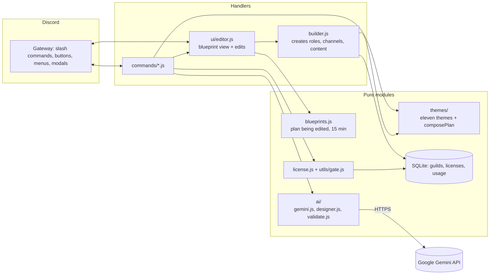
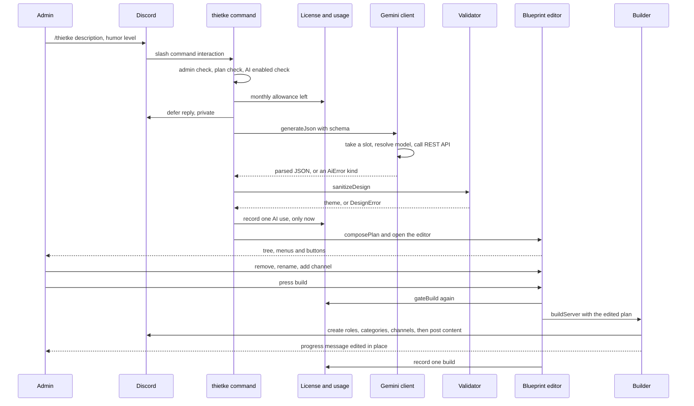
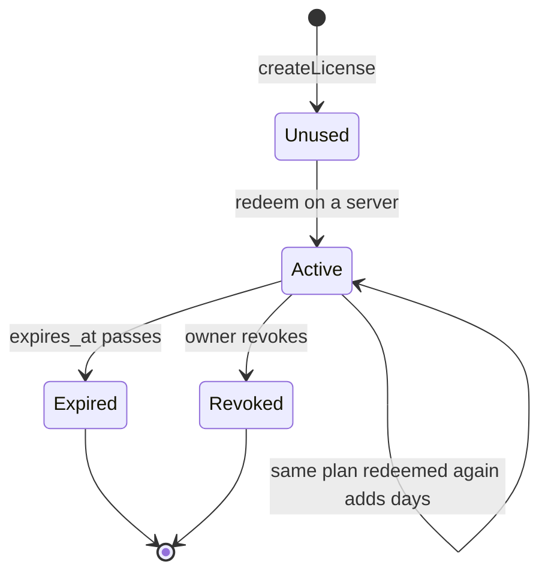

# Architecture

buildDISCORD is one Node process with one bot account. The design goal: everything interesting (merging themes, plans, licenses, cleaning an AI answer, editing a blueprint) lives in plain modules that never touch Discord, so it can be tested without a network. The files that know about Discord are the command files, `src/ui/editor.js`, `src/builder.js` and the event handlers.

## From a command to a server

1. `/build` merges the chosen themes into one **plan** with `composePlan`: shared parts first (admin area), then each theme's categories, then the DJ rooms and the mod-only area. Channels and categories with the same name appear once.
2. `/thietke` asks Gemini for a theme-shaped JSON, cleans it with `sanitizeDesign` and merges it with the same shared parts, so an AI server always has rules, welcome, role picker, DJ booth and a text-to-speech channel.
3. The plan becomes a **blueprint** held in memory for 15 minutes. `ui/editor.js` renders it as a tree with a select menu to remove a category, another to rename one, and buttons to add a channel, build or cancel. Only the person who started it, and only an administrator, can touch it.
4. **Build** runs `builder.js`: roles, then categories and channels (with permission overwrites for the mod-only area and read-only channels), then it posts the rules, welcome, role picker and the two invite buttons into the channels it just created. Each step edits one progress message. A lock stops two builds from running in the same server.
5. Every created ID is saved. `/nuke` deletes by those IDs, and the role buttons only grant roles in that list.

## Data

SQLite through the module built into Node 22 (`src/db.js`).

| Table | Columns | Holds |
| --- | --- | --- |
| `guilds` | `id` TEXT primary key, `record` TEXT (JSON), `updated_at` INTEGER | per server: the theme, and the IDs of the roles, pick-roles, categories and channels the bot created |
| `licenses` | `code` TEXT primary key, `plan`, `days`, `created_at`, `guild_id`, `redeemed_at`, `expires_at`, index `licenses_guild` on `guild_id` | one row per code, from creation to redemption |
| `usage` | `guild_id`, `month`, `feature`, `count` (default 0), primary key on the first three | counters: lifetime builds (`month = "all"`) and AI designs per UTC month |

The `record` column is a JSON document that is read and written whole and never filtered by field, so it stays a single column. Timestamps are milliseconds since the epoch. WAL mode is on so the daily `VACUUM INTO` copy can run while the bot writes.

A plan is derived, not stored: the highest-ranked license that has not expired, else free. Limits live in one table in `src/license.js`, and `utils/gate.js` turns them into refusals with a plain message.

## AI

`ai/gemini.js` talks to Google's REST API with `fetch`, sends the key in a header (never in the URL), asks for JSON that follows a schema, and picks a model by listing what the key can use. It caps the whole bot at ten requests a minute. `ai/validate.js` is the safety net: it never trusts the answer, it cleans it. Errors are classified (`off`, `key`, `quota`, `busy`, `unavailable`, `model`, `bad`) and each gets its own message. An unusable answer is retried once, a missing model is re-resolved once, and an overloaded service (5xx) is retried twice after 1.5 s and 4 s. If it still fails the person gets a message and the attempt is not counted.

## Running it

The Docker image runs `node src/index.js`. The bot writes `data/heartbeat` every 30 seconds, which is what the image's health check reads. `data/` is a mounted volume holding the database and the daily copies. On the Raspberry Pi a systemd timer runs `scripts/update.sh` daily: fast-forward only, rebuild, wait for healthy, roll back otherwise.

## A `/thietke` request from start to finish

## Licenses as a state machine

A code and a server's plan are two small state machines. The plan is never stored, it is computed from the codes.

A server's plan is the highest-ranked license that is Active at the moment of the query, otherwise `free`. Redeeming a second code of the same plan sets the new expiry to the later of now and the current expiry, plus the code's days. Revoking sets `expires_at` to now, so the same query ends it with no extra state.

## Failure modes

| What goes wrong | What happens | Where it is handled |
| --- | --- | --- |
| The bot lacks a permission | The command stops before creating anything and names the missing permissions | `missingBotPermissions` in `utils/guards.js` |
| Two builds start in one server | The second is refused with a "still under construction" message | per-guild lock in `utils/guards.js` |
| A build crashes halfway | The error is shown and logged; re-running skips what exists. IDs are saved only after creation finishes, so `/nuke` may not know about a partial build (known gap) | `builder.js`, `ui/editor.js` |
| `/build` is run twice | Existing roles, categories and channels are reused, and content is posted only to channels that were just created | `ensure*` in `builder.js` |
| A blueprint is left open for too long, or across a restart | The next click answers "expired, run the command again" | `blueprints.js`, `ui/editor.js` |
| Gemini is unavailable, rate limited, or the key is wrong | A plain message per error kind; the attempt is not counted against the server | `ai/gemini.js`, `commands/thietke.js` |
| Gemini returns something unusable | One retry, then a message; nothing is created | `ai/designer.js`, `ai/validate.js` |
| Too many AI requests at once | Refused locally once ten calls were made in the last minute | `takeSlot` in `ai/gemini.js` |
| The bot process crashes | `restart: unless-stopped` starts it again and the start-up message goes to the webhook (the same message at most once per five minutes) | `alerts.js`, `docker-compose.yml` |
| The bot process hangs without exiting | Docker marks the container unhealthy after about 90 seconds and the updater refuses to call a version good; Docker does not restart an unhealthy container by itself (known gap) | `healthcheck.js`, `scripts/update.sh` |
| An update ships a broken version | The updater waits for healthy, then resets to the previous commit and rebuilds | `scripts/update.sh` |
| The database file is damaged or deleted | Restore the latest of the seven daily copies from `data/backups` | `backup.js` |
| An error happens inside a handler | It is logged, alerted, and the user gets a friendly private message instead of an unhandled rejection | `events/interactionCreate.js` |

## Security model

**Who is trusted.** Only the bot owner, identified by `OWNER_IDS`, can use `/admin`. Within a server, only members with the Administrator permission can build, nuke, activate a plan or erase data. Everyone else can only use `/goi` and `/roast` and press the role buttons.

**Defence in depth on commands.** Commands set `setDefaultMemberPermissions`, and the handler also checks `isAdmin` at runtime, because a server administrator can change who may use a command from the server's integration settings. `/admin` sets default permissions to none and then checks the owner list.

**Every interactive component is authorised again.** A `customId` can be forged. The editor checks that the blueprint exists for this guild, that the clicker is the person who opened it, and that they are an administrator, on every select, modal and button. The role buttons only grant a role that is in the guild's recorded list of self-assignable roles.

**What is validated.** All AI output goes through `sanitizeDesign`: mentions are stripped, text is capped, a blocked-word list is applied, counts are bounded, colors are parsed with a fallback, and an empty result is an error. The description a person types is limited to 400 characters and is only ever placed in the user message. Plan limits are enforced in `gateBuild` when a blueprint opens and again when build is pressed.

**What the bot refuses to do.** It does not read message content and uses only the `Guilds` intent. It deletes only IDs it recorded, never by name. It does not remove the admin area from a blueprint. It does not create anything from an AI answer without a person pressing build. It does not log or return the Gemini key, which is sent in a header.

**Secrets and data.** The Discord token and the Gemini key live only in `.env`, which is ignored by Git (the whole `data/` folder is too). The database stores guild IDs, IDs of what the bot created, licenses and counters, and no message content. `/xoadulieu` erases a server's record while keeping its license and counters so plan limits still apply.

**Known limits.** The blocked-word filter is a last net, not moderation. Prompt injection is mitigated (data kept out of the system prompt, schema-constrained output, validation, preview) but not eliminated. License redemption relies on a single process with a synchronous SQLite driver; running several processes would need a changed-row check on the redeem update.
